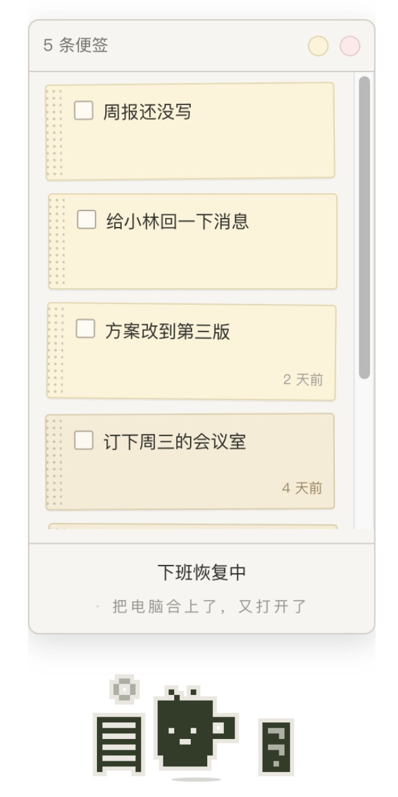

# 职场生物

一只活在真实时间里的像素桌宠，兼一块便签板。

**你把心里压着的东西写在便签上，交给它拿着。** 堆得越多它越沉，划掉一件它松一口气，
放太久的那张它会替你提起来。

它不催你、不评价你、不会因为你不管它而死——它只是替你拿着这些东西。

<p align="center">
  <br>
  
</p>

> **定位：作品，不是产品。** 及格线是「作者自己用一个月还想用」。
> 没有推送、没有社交、没有成长曲线，也不打算有。

---

## 跑起来

macOS，需要 Node 18+。

```bash
npm install          # 只需第一次
```

然后**双击 `快速启动.command`**，它就站到桌面上了。

它不占 Dock、不进 Cmd+Tab，所以**出口只有右键菜单**——里面有按天回看、图鉴、
导出存档、导入存档、退出。右键点不到的时候（会发生），`Control+Option+Command+Q` 强制退出。

同时只会有一只。重复双击不开新的，只会把已经在的那只叫到跟前。

### 存档

存档和自动备份都在这儿：

```
~/Library/Application Support/workplace-creature/
```

`save-backup.json` 加两代历史，最多一分钟写一次。同目录下还有 `llm.json`（AI 配置，
只在你这台电脑上，不进仓库也不跟着存档导出）。这份备份**只进不出**：程序不会自己回滚，
要恢复得走右键菜单的「导入存档」手动选文件——自动恢复的风险是拿旧的盖掉新的。

---

## 有什么

| | |
|---|---|
| **测评生成** | 20 张痛苦卡挑 5 张最戳的 + 3 张无感的 → 五轴 → 20 原型之一，各 5% 均等。结果页：「你一次就能做对。代价是别人总以为你还没开始。」 |
| **便签** | 一块便签板：两个圆钮放下黄 / 粉便签，字就地敲、随时改、拖着排、随手删。不设时间点。<br>两种颜色功能上完全一样，**颜色只改变它的反应**：黄色堆成地上的纸（有重量），粉色飘成头顶的泡泡（没有重量） |
| **负载** | 未勾选的黄色 → 纸堆堆高 → 把它压弯 → 它说的话换档。**没有任何隐藏数值**，你看见的纸堆就是全部 |
| **它记得** | 放超过 3 天没勾的黄色它会提起，带天数；粉色 4 天后被翻出来重提 |
| **它自己的一天** | 职位任务池随机排 / 周末爱好 / 周日晚上的专属文案。**你的便签不进它的日程** |
| **画面** | 16×16 整格跳动 + 七种场景动画（写字 / 改稿 / 打电脑 / 开会 / 摸鱼 / 吃饭 / 睡） |
| **图鉴与抽卡** | 20 只收集册。记东西攒分（每日上限 20），30 分抽一只，会重复。**换宠物时便签一条不动** |
| **它的即兴**（可选） | 状态栏后面那半句，一天冒六七句。**由大模型每天生成一批**，用它的物种、性格、职位和「手边那摞东西是什么形状」写。没配 key 就走静态池，一样有 |
| **撤销** | 删便签后原地留一行「撤回来」，6 秒后消失 |
| **按天回看** | 按**划掉的那天**排，写的是你划掉它时它上面的字。便签随时可编辑，所以回看存的是勾选那一刻的快照，不是便签本体——否则今天改一个字，三天前那条记录会跟着变 |

---

## 改东西

`data/*.json` 是唯一事实来源。改完必须重新打包（这一步需要 Python 3）：

```bash
python3 build-data.py        # data/*.json → js/data.js
```

页面实际读的是生成出来的 `js/data.js`，**别手改它**。
调数值、加文案、加组合梗都只动 JSON，不用碰代码。

### 改某一只的专属小动作

20 只**共用**的动作——呼吸、压弯、眨眼、接便签时侧身一沉——在 `style.css` 和 `ui.js` 里，
不挑原型。

`sprites.js` 里的 `idle` / `take` 是那一只**自己的**小动作（马克杯的热气、剪刀的咔嚓、
蜗牛的触角）。20 只都有，格式一样：

```js
idle: { stepMs: 460, frames: [
  [[1,4],[0,6],[1,8]],     // 每帧点亮哪几个 [行, 列]
  ...
]}
```

不画新帧，只按帧开关几个像素。坐标只能落在空格上，压在身体上就看不见了。

### 跳过测评、固定成某一只

调试首次流程用的。`Control+Option+Command+I` 打开控制台（菜单里没有这一项，是个暗门），
然后放一个键进 localStorage：

```js
localStorage.setItem('workplace-creature/local', '{"forcePrototype":"R15"}')
```

它在 localStorage 里、不在仓库里，所以 `git pull` 冲不掉，也不会被误提交。
撤掉：`localStorage.removeItem('workplace-creature/local')`。

只影响**新建**的存档。已经有的那只想换，图鉴里点一下就行，便签一条不动。

---

## 结构

```
index.html          228px 宽的窗，宽度跟着便签走。渲染进程加载的就是它
style.css
快速启动.command    双击启动
preview.html        开发用：20 只并排看轮廓和动画，双击打开，不用起服务
build-data.py       data/*.json → js/data.js

desktop/            桌面壳（Electron）。也可以 npm run desktop 启动
  main.js             主进程：透明置顶窗、点击穿透、换形态、右键原生菜单、不进 Dock
  preload.js          渲染进程能碰到的全部桌面能力，就那七条（含存档备份）
  desktop.js          桌面形态的交互：悬浮显板、单击钉住、拖着走
  desktop.css         桌面形态的样式
  llm.js              带 key 发请求。key 只在这一层，渲染进程碰不到
  package.json        只为把这一层声明成 CommonJS（根目录是 type:module）

data/               唯一事实来源，字段说明见 data/README.md
  rules.json          时段 / 日型 / 离线补算 / 职级 / 日程与随机事件约束
  prototypes.json     20 原型 + style + 专属文案
  assessment.json     20 张痛苦卡 + 五轴 + 均等化偏置 + 结果页镜像文案
  notes.json          便签文案与负载档位
  classify.json       分类枚举 + 关键词规则 + 负载判定
  gacha.json          积分与抽卡
  notemap.json        便签 kind → 提起时闪哪个场景
  riff.json           「即兴」的提示词与参数（生成频率、时间窗、一次几句）
  dayplan.json        「它自己的一天」的提示词与参数
  jobs / tasks / events / combos / copy

js/
  data.js             自动生成，勿手改
  sprites.js          20 个 16×16 轮廓 + 可动部件
  scene.js            场景层：像素道具 + 纸堆 + 头顶泡泡
  classify.js         便签分类（关键词默认，LLM 可选）
  engine.js           时间推进 / 离线补算 / 便签 / 积分抽卡
  ui.js               渲染与交互

tools/                手动跑的离线工具
  classify-llm.mjs    便签分类（结果目前没有消费方）
  dayplan-llm.mjs     生成「它自己的一天」
```

---

## LLM（可选，不装也能用）

**不填 key 就是完整的产品，不是残废版。** 所有 LLM 产出都是覆盖层，
底下一直是 `data/*.json` 的静态文案；没 key、断网、超时、失败，走的都是同一条路。

屏幕上那两行字是两条独立的通道，别看混：

```
开会中                            ← 黑字：它在干嘛。随机排的，不走 LLM
它把杯壁往桌沿一磕，茶水晃出小半圈  ← 灰字：AI 每天生成
```

### 自动的：即兴（灰字那行）

每天早上八点后开机时生成 20 句存进存档，之后离线播——**不是每次说话都联网**。
一天露六七句，其余时候用静态池。

配置在右键菜单「AI 文案设置…」，或直接改
`~/Library/Application Support/workplace-creature/llm.json`：

```json
{
  "apiKey": "你的服务商给的密钥",
  "baseURL": "接口地址，照服务商文档填。留空走默认",
  "model": "模型名，照服务商文档填"
}
```

> 这套代码按 Messages 协议（`/v1/messages`）发请求。多数服务商都提供这样一个
> 兼容入口，在它们文档里通常叫「Anthropic 兼容」或「Claude 兼容」。

提示词和频率在 `data/riff.json`、`data/copy.json` 的 `impulse` 段，都是数据，改完
`python3 build-data.py` 就生效。

**便签原文不出这台电脑**：模型写的是带 `{text}` 占位符的模板，原文在本地填进去。
送出去的只有它的身份和「手边那摞东西是什么形状」的统计。

### 手动的：两个离线工具

```bash
node tools/dayplan-llm.mjs  存档.json --days 7 --dry   # 它自己的一天
node tools/classify-llm.mjs 存档.json --dry            # 便签分类
```

读 `ANTHROPIC_API_KEY`。两个都**不参与日常运行**：

- `dayplan` —— 它的日程默认从职位任务池随机排，**有意不接 LLM**。日程是主干，
  乱了一整天都不对，不值得为它引入一条会失败的依赖。跑这个工具能覆盖掉随机日程
- `classify` —— 结果目前没有消费方，留着是因为将来接回来比重写便宜

---

## 协议

代码 MIT，见 [LICENSE](LICENSE)。

`data/*.json` 的文案、`js/sprites.js` 的 20 只形象走 CC BY-NC 4.0——自己用、改、
二次创作都行，不可商用，见 [LICENSE-CONTENT](LICENSE-CONTENT)。
