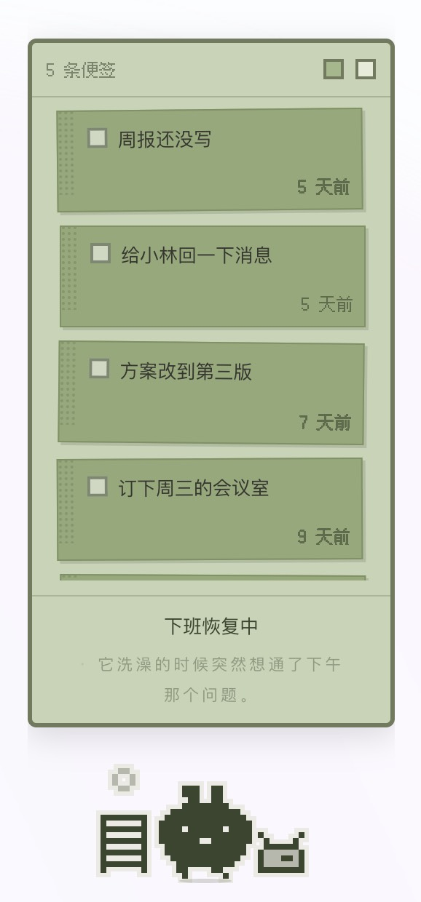

# 职场生物_桌面便签工具

一只运行在真实时间中的像素桌宠，同时是一块便签板。

**你把待办和心事写在便签上，交给它保管。** 便签越积越多，它的状态随之变化；
划掉一条，它的负担随之减轻；搁置过久的便签，它会主动提起。

它不会催促、不会评价，也不会因疏于照料而死亡——它的唯一职责是替你记着这些事。

首次启动会进行一次三步测评，从 20 个性格原型中匹配出属于你的那一只——每一只的性格、说话方式与专属动画均不相同，详见下方「测评生成」。

<p align="center">
  <br>
  
</p>


---

## 快速开始

系统要求：macOS，Node 18 及以上。

```bash
npm install          # 首次运行需要
```

安装完成后双击 `快速启动.command` 即可启动。

应用不占用 Dock 图标，也不出现在 Cmd+Tab 切换列表中，因此所有操作入口集中在右键菜单，
包括按天/月回看、图鉴、导出存档、导入存档与退出。若右键菜单无法正常调出（偶有发生），
可使用 `Control+Option+Command+Q` 强制退出。

同一时间只允许运行一个实例；重复启动不会新建窗口，而是将已运行的实例带到前台。

### 存档

存档文件与自动备份均位于：

```
~/Library/Application Support/workplace-creature/
```

`save-backup.json` 保留最近两代历史，写入间隔不超过一分钟。同目录下的 `llm.json`
为 AI 配置文件，仅存于本机，不纳入代码仓库，也不随存档导出。

备份仅用于写入，不会自动回滚：如需恢复，需通过右键菜单的「导入存档」手动选择文件。
不做自动恢复是为了避免旧数据覆盖新数据。

---

## 功能说明

| | |
|---|---|
| **测评生成** | 三步测评：从 20 张情境卡中选出最受不了的 5 张（正选）与完全无感的 3 张（反选），映射为五个性格维度，匹配 20 个原型之一（各原型概率均等，各 5%）；再选出 5 项业余爱好，仅用于生成周末专属文案，不参与原型匹配。|
| **便签** | 内置便签板，通过两个方块按钮新建深绿或浅绿便签，支持就地编辑、拖拽排序与删除，不设置提醒时间。两种颜色在功能上完全一致，区别仅在于宠物的视觉反应：深绿便签会堆积为地面上的纸堆（带有重量感），浅绿便签则以气泡形式漂浮在头顶（不带重量感） |
| **负载** | 未完成的深绿便签会持续堆高纸堆，进而影响宠物的姿态与对话内容。系统不设隐藏数值，纸堆的高度即是全部状态呈现 |
| **提醒** | 深绿便签搁置超过 3 天会被主动提及，并标注天数；浅绿便签则在第 4 天被重新提起 |
| **日程** | 日程由对应职位的任务池随机生成，另设周末爱好与周日晚间专属文案。用户的便签内容不会进入其日程安排 |
| **画面** | 16×16 像素网格动画，包含写字、改稿、打字、开会、摸鱼、吃饭、睡觉七种场景动画。界面本身也是一块液晶屏：便签板、回看与图鉴共用同一套屏底色与外框，界面文字使用 12px 点阵字体；你自己写的内容与它说的话仍用系统字体，长句可读性优先 |
| **图鉴与抽卡** | 共 20 个可收集形态。积分来自记录行为而非照料行为：写满一张深绿便签 +2 分、写满一张浅绿便签 +3 分、划掉一条 +1 分，每日累计上限 20 分。抽卡消耗 30 分一次，抽到已拥有的形态退还 8 分。切换形态不影响已有便签 |
| **即兴文案**（可选） | 状态栏后半句的补充文案，每天出现六到七次。由大模型每日批量生成，依据宠物的物种、性格、职位及当前便签堆积情况生成内容；未配置密钥时使用内置静态文案库，不影响功能完整性 |
| **撤销** | 便签删除后保留 6 秒的撤销提示，超时后自动清除 |
| **回看** | 按完成日期排列，记录的是便签被勾选完成那一刻的文本内容。由于便签支持随时编辑，回看记录保存的是完成时的快照而非实时引用，以避免后续修改影响历史记录。可以月份为单位回看每日完成的便签数量。回看与图鉴的面板宽度跟随便签板，不另设宽度 |

---

## 开发说明

`data/*.json` 是数据的唯一事实来源。修改后需重新构建（需要 Python 3）：

```bash
python3 build-data.py        # data/*.json → js/data.js
```

页面实际加载的是构建生成的 `js/data.js`，不应手动修改。调整数值、文案或组合内容，
只需编辑 JSON 文件，无需改动代码。

### 修改专属动画

20 个原型共用的通用动画——呼吸、受压弯曲、眨眼、接收便签时的侧身动作——定义在
`style.css` 与 `ui.js` 中，与具体原型无关。

`sprites.js` 中的 `idle` / `take` 字段为每个原型独有的专属动画（如马克杯的热气、
剪刀的开合、蜗牛的触角摆动），20 个原型均已实现，格式统一：

```js
idle: { stepMs: 460, frames: [
  [[1,4],[0,6],[1,8]],     // 每帧点亮哪几个 [行, 列]
  ...
]}
```

动画通过逐帧切换像素点亮状态实现，无需绘制新帧。坐标须落在空白区域，
若与主体图形重叠将无法显示。

### 调试模式：跳过测评并指定原型

用于调试首次启动流程。通过 `Control+Option+Command+I` 打开开发者控制台
（该入口未在菜单中提供），在 localStorage 中设置以下键值：

```js
localStorage.setItem('workplace-creature/local', '{"forcePrototype":"R15"}')
```

该配置存储于 localStorage，不纳入代码仓库，因此不受 `git pull` 影响，也不会被误提交。
移除方式：`localStorage.removeItem('workplace-creature/local')`。

此设置仅影响新建存档；若需更换已有存档的形态，可在图鉴中直接选择，不影响已有便签。

---

## 项目结构

```
index.html          主窗口，宽度为 228px 并随便签内容自适应，渲染进程加载的入口文件
style.css
快速启动.command    双击启动应用
preview.html        开发预览页：并排展示 20 个原型的轮廓与动画，双击打开，无需启动服务
build-data.py       构建脚本：data/*.json → js/data.js

desktop/            桌面壳（Electron），也可通过 npm run desktop 启动
  main.js             主进程：透明置顶窗口、点击穿透、形态切换、原生右键菜单、不显示 Dock 图标
  preload.js          暴露给渲染进程的全部桌面能力接口，共七项（含存档备份）
  desktop.js          桌面形态交互逻辑：悬浮面板、单击固定、拖拽移动
  desktop.css         桌面形态样式
  llm.js              携带密钥发起请求，密钥仅存在于此层，渲染进程无法访问
  package.json        声明该目录为 CommonJS 模块（根目录为 type:module）

fonts/              界面点阵字体与其授权文件
  fusion-pixel-12px.woff2   Fusion Pixel 12px 子集（源码用字 + GB2312），仅供界面文字使用

data/               数据的唯一事实来源，字段说明见 data/README.md
  rules.json          时段、日型、离线补算、职级、日程与随机事件规则
  prototypes.json     20 个原型的属性、样式与专属文案
  assessment.json     20 张情境卡、五个性格维度、均等化偏置与结果页文案
  notes.json          便签文案与负载档位
  classify.json       分类枚举、关键词规则与负载判定
  gacha.json          积分与抽卡规则
  notemap.json        便签类型与场景动画的映射
  riff.json           「即兴」文案的提示词与生成参数（频率、时间窗、单次条数）
  dayplan.json        「它自己的一天」的提示词与生成参数
  jobs / tasks / events / combos / copy

js/
  data.js             构建自动生成，请勿手动修改
  sprites.js          20 个原型的 16×16 轮廓及可动部件定义
  scene.js            场景层：像素道具、纸堆、头顶气泡
  classify.js         便签分类逻辑（默认关键词匹配，可选接入 LLM）
  engine.js           时间推进、离线补算、便签处理、积分与抽卡逻辑
  ui.js               渲染与交互逻辑

tools/                独立运行的离线工具脚本
  classify-llm.mjs    便签分类（当前结果暂无消费方）
  dayplan-llm.mjs     生成「它自己的一天」的内容
```

---

## LLM 集成（可选）

**未配置密钥时，产品功能完整可用，并非受限版本。** 所有 LLM 生成内容均为覆盖层，
底层始终保留 `data/*.json` 中的静态文案；无论是未配置密钥、网络异常、请求超时
还是调用失败，均会回退至静态文案，行为一致。

界面上的两行文字对应两条相互独立的通道：

```
开会中                            ← 黑字：状态标签，随机排定，不依赖 LLM
它把杯壁往桌沿一磕，茶水晃出小半圈  ← 灰字：由 AI 每日生成
```

### 即兴文案（灰字，自动生成）

每天首次启动（早 8 点后）时生成 20 句文案并存入存档，此后离线播放，并非每次显示都发起请求。

是否显示由两层概率控制：清醒时段内每 13 分钟为一格，每格有 33% 概率触发一次「即兴」；
触发后再有 33% 概率使用当天生成的 AI 文案，其余情况使用内置静态文案。两层概率叠加后，
AI 文案平均每天出现六到七次，实际次数会有随机波动。睡眠时段不触发。

配置入口为右键菜单「AI 文案设置…」，或直接编辑
`~/Library/Application Support/workplace-creature/llm.json`：

```json
{
  "apiKey": "你的服务商给的密钥",
  "baseURL": "接口地址，照服务商文档填。留空走默认",
  "model": "模型名，照服务商文档填"
}
```

> 请求遵循 Messages 协议（`/v1/messages`）。多数模型服务商提供兼容该协议的接口，
> 通常在其文档中称为「Anthropic 兼容」或「Claude 兼容」。

提示词与生成频率定义在 `data/riff.json` 与 `data/copy.json` 的 `impulse` 字段中，
修改后执行 `python3 build-data.py` 即可生效。

**便签原文不会离开本机**：发送给模型的是带 `{text}` 占位符的模板，原文在本地完成填充；
实际传输内容仅包含宠物身份信息与便签堆积状态的统计数据。

---

## 许可协议

代码部分遵循 MIT 协议，见 [LICENSE](LICENSE)。

`data/*.json` 中的文案与 `js/sprites.js` 中的 20 个形象设计遵循 CC BY-NC 4.0 协议，
允许个人使用、修改与二次创作，禁止商业用途，见 [LICENSE-CONTENT](LICENSE-CONTENT)。

`fonts/fusion-pixel-12px.woff2` 是 [Fusion Pixel Font（缝合像素字体）](https://github.com/TakWolf/fusion-pixel-font)
12px 比例版的子集，遵循 MIT 协议，其上游各字体的授权见 [fonts/OFL.txt](fonts/OFL.txt)
与 [fonts/LICENSES/](fonts/LICENSES)。子集裁剪方式见 [fonts/README.md](fonts/README.md)。
